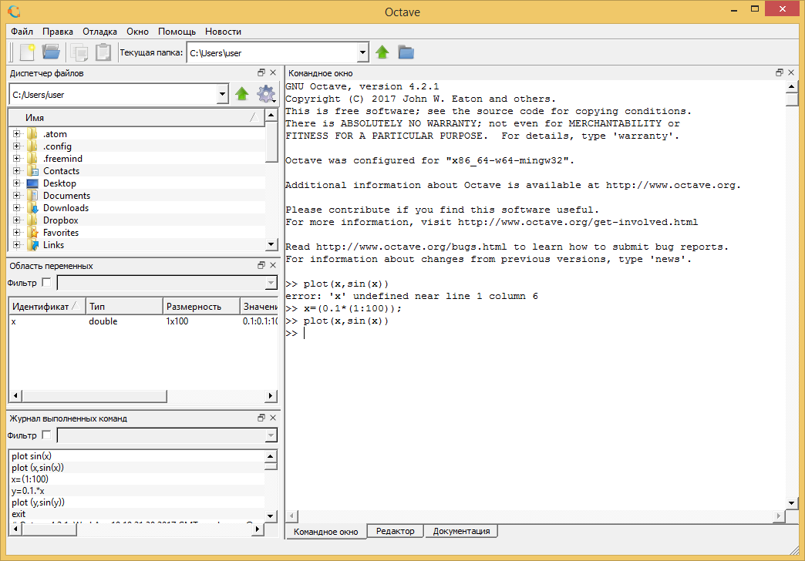
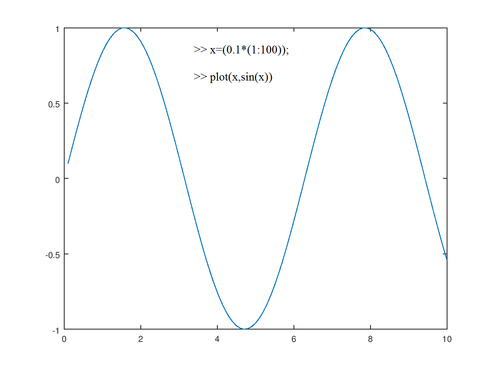

# Matlab
Matlab, или mathematical laboratory - это язык
программирования, созданный в 1984 году. Основная 
особенность - работа с данными как с матрицами.
Иными словами, он воспринимает и обрабатывает любые
данные как матрицы и осуществляет над ними действия
по правилам линейной алгебры.

Одной из бесплатных версий является программа
**Octave**. По умолчанию работа осуществляется в командной
строке, но имеется и пользовательский интерфейс, где
есть различные меню, справки, а также история команд.



**Примеры**:



Мы можем загрузить текстовый документ с исключительно
численными данными, присвоить его некоторой переменной
и работать с ним.
```
a=load ('m3.txt');
% Так мы присваиваем второй столбец другой переменной
(в нашем случае - это синусоидальные колебания напряжения):
b=a(:,2);
```
Также внутри программы есть основные встроенные математические
функции и операторы для необходимых преобразований.
Например, быстрое преобразование Фурье обозначается функцией fft:

```
c=fft(b);
% Так как с - комплексное число, то с помощью функции abs
находим сразу её модуль:
plot(abs(c))
```

.png)

Чтобы построить несколько графиков в одном окне, пишем команду subplot,
в скобках через запятую указываем число строк, столбцов и текущее расположение.

```
subplot (2,1,1)
```

Так как за b у нас обозначены колебания напряжений, а нам известно, 
что частота колебаний равна 500 кГц, то по оси х отложим время, соответствующее
этим колебаниям, то есть

```
x=((1:150000)/500000);
% и строим b(x):
plot(x,b)
```

.png)

Затем переходим на место расположения другого графика:

```
subplot (2,1,2)
```

Теперь строим зависимость модуля БПФ от частоты, для чего создаём переменную y:

```
y=(1:150000)*(50/15);

plot (y,abs(c))
```

.png)
