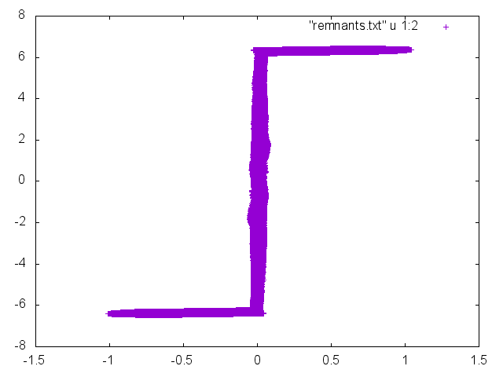

# Cygwin

Cygwin (произносится /ˈsɪgwɪn/)[2] — UNIX-подобная среда и интерфейс командной
строки для Microsoft Windows. Cygwin обеспечивает тесную интеграцию приложений,
данных и ресурсов Windows с приложениями, данными и ресурсами UNIX-подобной 
среды. Из среды Cygwin можно запускать обычные приложения Windows, также можно 
использовать инструменты Cygwin из Windows.

Это свободное ПО, опубликованное под GNU General Public License версии 2.

Поддерживает языки C, C++, Objective-C, Fortran, Gambas, Perl, Python, Ruby и другие.


### Работа с каталогами:

**Pwd** - Путь рабочего (текущего) каталога

**Ls** - Список - список файлов в текущем каталоге

**Cd <путь каталога>** - переход в указанный каталог

**Ls-l**  - Список файлов и их атрибутов

**Cp -R <каталог> <новый каталог>**  - Создать копию каталога

### Работа с файлами:

**Cp <filename> <new filename>** - Создать копию файла

*Mv <filename> <new filename>** - перемещение или переименование файла

**Rm <filename>** - удалить файл

**sed -<command> <filename>** - не загружая указанный файл, исполняет над ним
указанную команду.

**grep** - поиск в файлах вхождений чего-либо: возвращает номера строк, в которых
содержится аргумент.

## Пример построения графика

Мы имеем файл с огромным объёмом данных - 30 млн показаний тока и напряжения.
Оперативной памяти с использованием классических пользовательских программ может
не хватить. Cygwin позволяет обращаться к файлам, не открывая их - именно за счёт
этого мы можем относительно легко построить график.

Файл big.txt:

Обрезаем первые 19 строк (символьные), создаём remnants.txt, 
где будут только численные данные:

```
sed -e '1,19d'<big.txt>remnants.txt
```

С помощью gnuplot строим график по показаниям remnants.txt

```
gnuplot -e 'set terminal png; set out "see.png" plot "remnants.txt" u 1:2'
```
