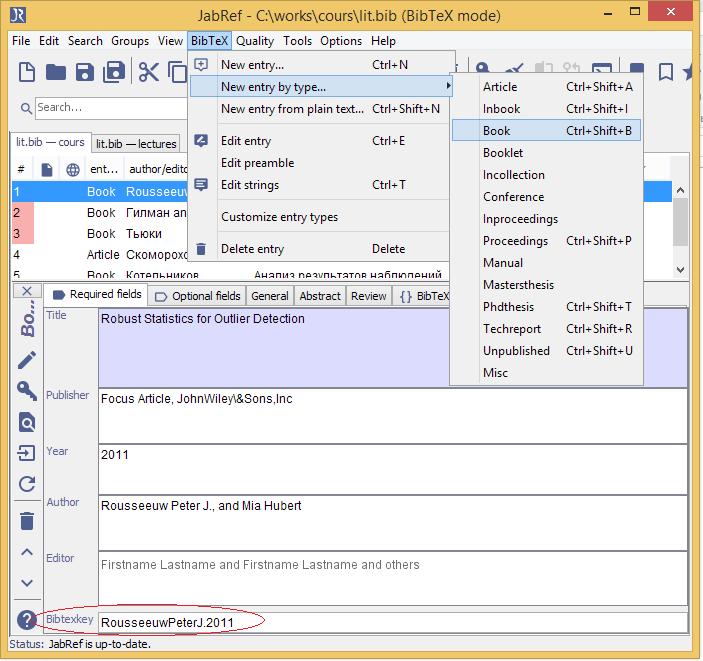
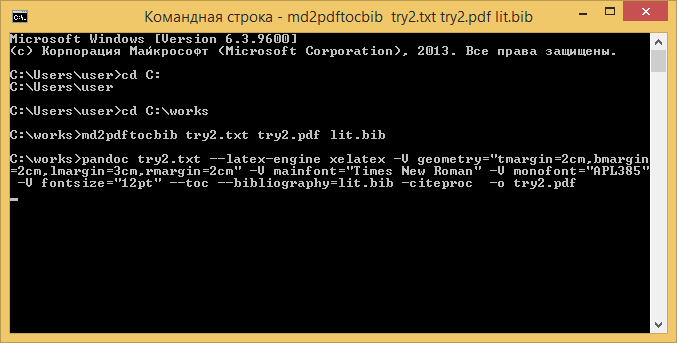

# Jabref

Это система управления библиографической информацией. Она использует Bibtex как
базовый формат. При этом она представляет нам удобный пользовательский интерфейс
для записи и редактирования используемой нами литературы при создании различных
работ, статей, книг и т.д. в формате BibTeX. 

Запись в формате BibTeX позволяет записать полученный список литературы по всем правилам оформления.

## Возможности программы

- Полностью совместим с BibTeX

- Полнотекстовый поиск по всей библиографии.

- Импорт различных форматов: BibTeXML, CSA, Refer/Endnote, Web of Knowledge, SilverPlatter, Medline/Pubmed (xml), Scifinder, OVID, INSPEC, Biblioscape, Sixpack, JStor and RIS.

- Экспорт в разных форматах HTML, Docbook, BibTeXML, MODS, RTF, Refer/Endnote и OpenOffice.org.

- Группировка по любым полям BibTeX, ключевым словам.

- Интеграция с десктоп-окружением: запуск программ просмотра PDF/PS, браузера, вставка цитирований в LyX, Kile, LatexEDitor, Emacs, Vim и WinEdt, OpenOffice.org (с помощью плагина)

- Поддержка плагинов — расширений.

- Автоматическое создание BibTeX ключей

## Примеры использования

При написании курсовой работы, а также конспекта лекций мы формируем список используемой литературы в JabRef.

Внутри работы в нужных местах мы делаем ссылки на каждую книгу из списка, где внутри квадратных скобок
после значка \@ стоит соответствующий bibtex key. 

Затем при переводе из md в pdf с помощью pandoc, используя специальный bat-файл, третьим аргументом мы указываем этот самый .bib-файл.

В результате, в конце присоединяется оформленный по всем правилам список литературы.